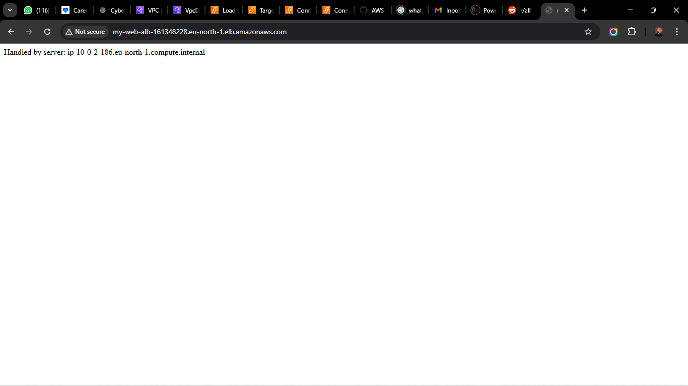
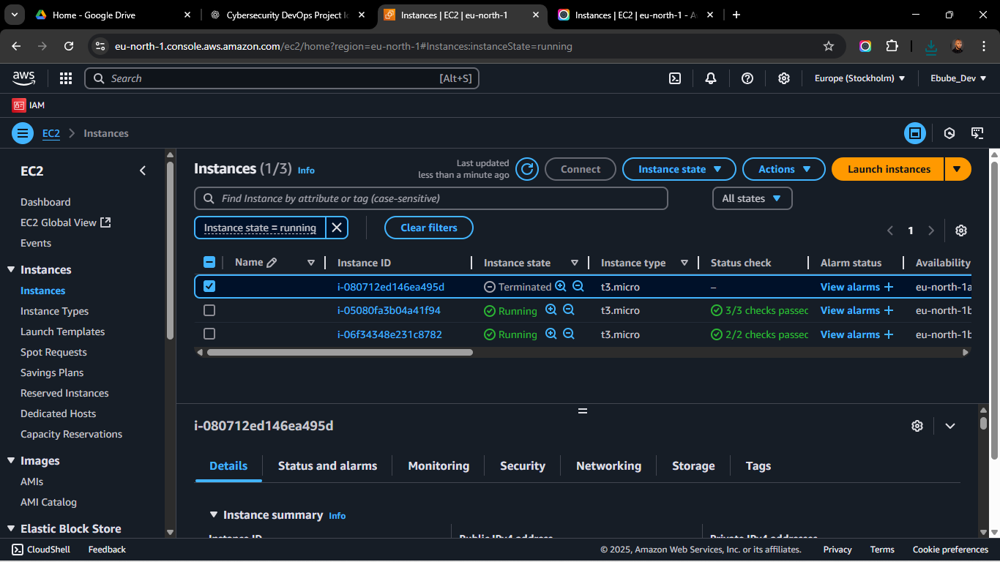

# Deploying-a-Load-Balanced-Web-Application-on-AWS


### Table of Contents
```md
## 📑 Table of Contents
1. [Project Overview](#project-overview)
2. [Architecture Diagram](#architecture-diagram)
3. [VPC Setup](#vpc-setup)
4. [Subnet Configuration](#subnet-configuration)
5. [Internet and NAT Gateway](#internet-and-nat-gateway)
6. [EC2 Instance Setup](#ec2-instance-setup)
7. [Nginx + App Deployment](#nginx--app-deployment)
8. [Application Load Balancer Setup](#alb-setup)
9. [Auto Scaling Group Setup](#asg-setup)
10. [Testing & Validation](#testing--validation)
11. [Screenshots](#screenshots)
12. [Conclusion](#conclusion)
```

---

### 📖 Project Overview
```md
This project demonstrates how to deploy a fault-tolerant, load-balanced web application on AWS using:
- VPC with public and private subnets
- NAT Gateway and Internet Gateway
- Nginx web servers on EC2 instances
- Application Load Balancer
- Auto Scaling Group
```

---

### 🧭 Architecture Diagram
```md
)
```

---

### 🏗️ VPC Setup
```md
- Created a custom VPC with CIDR block: `10.0.0.0/16`
- Three subnets created:
  - `10.0.0.0/24` (Public Subnet for ALB & NAT)
  - `10.0.1.0/24` (Private Subnet 1)
  - `10.0.2.0/24` (Private Subnet 2)
- Added route tables:
  - Public route table with a route to Internet Gateway
  - Private route table with a route to NAT Gateway
```

_Screenshot example:_
```md

```

---

### 🌐 Internet and NAT Gateway
```md
- Created and attached an Internet Gateway to the VPC
- Created an Elastic IP and used it with a NAT Gateway in the public subnet
- Ensured private subnets can reach the internet through NAT Gateway
```

---

### 🧱 Subnet Configuration
```md
| Subnet Name        | Type    | AZ        | CIDR        |
|--------------------|---------|-----------|-------------|
| public-subnet      | Public  | eu-north-1a | 10.0.0.0/24 |
| private-subnet-1   | Private | eu-north-1a | 10.0.1.0/24 |
| private-subnet-2   | Private | eu-north-1b | 10.0.2.0/24 |
```

---

### 🖥️ EC2 Instance Setup
```md
- AMI: Amazon Linux 2
- Deployed EC2 instances into private subnets
- Used Bastion Host in public subnet for SSH access
- Security Group:
  - Bastion Host: Allows SSH from `My IP`
  - EC2 Web Servers: Allow HTTP from ALB SG and SSH from Bastion SG
```

---

### ⚙️ Nginx + App Deployment
```md
Installed and configured Nginx:

```bash
sudo yum update -y
sudo amazon-linux-extras install nginx1 -y
sudo systemctl start nginx
sudo systemctl enable nginx
```

**Simple PHP App**
```php
<?php echo "Served from: " . gethostname(); ?>
```

_Deployed to `/usr/share/nginx/html/index.php`_
```

---

### 🧮 ALB Setup
```md
- Deployed Application Load Balancer in the public subnet
- Created Target Group with health checks on port 80
- Registered both EC2 instances from private subnets
- ALB DNS: `http://your-alb-dns.amazonaws.com`


```

---

### 🚀 Auto Scaling Group (ASG)
```md
- Used launch template with Nginx setup
- Target Group attached to the ASG
- Desired: 2 | Min: 2 | Max: 4
- Verified scaling by terminating an instance


```

---

### ✅ Testing & Validation
```md
- Accessed ALB URL and refreshed to see different hostnames
- Terminated an EC2 instance and saw a new one launch automatically
- Verified healthy targets in ALB console
```

---

### 📸 Screenshots

```md
#### VPC Topology


#### Nginx App Output


#### Target Group Health


#### Auto Scaling Group

```

---

### 🧾 Conclusion
```md
This project shows how to deploy a production-ready architecture on AWS that is:
- Scalable
- Fault-tolerant
- Secure
- Easy to monitor and update

All scripts and templates used in this project can be found in the repository.
```

